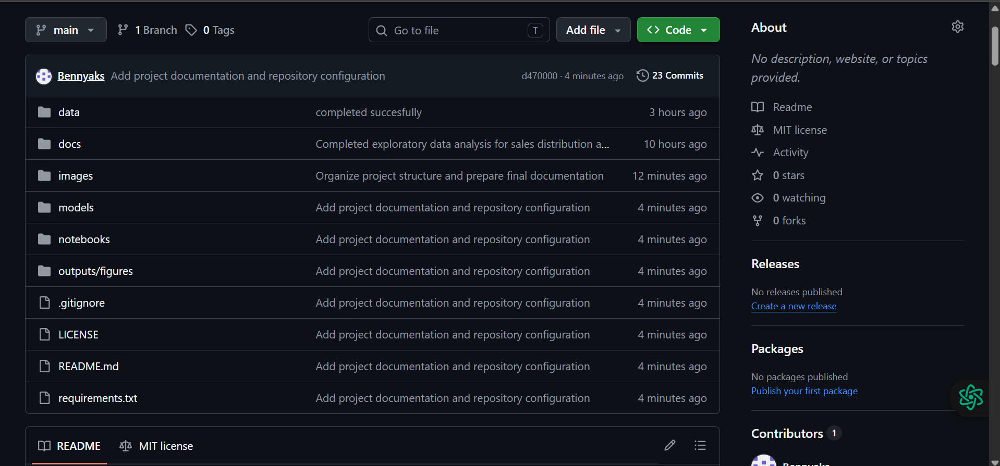
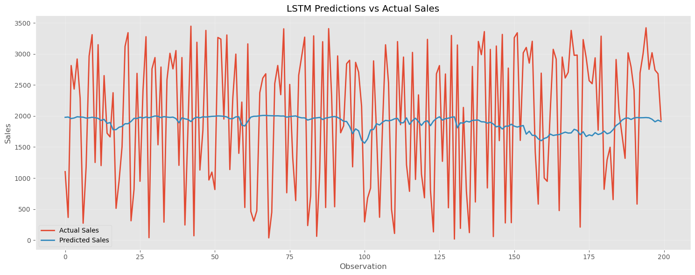
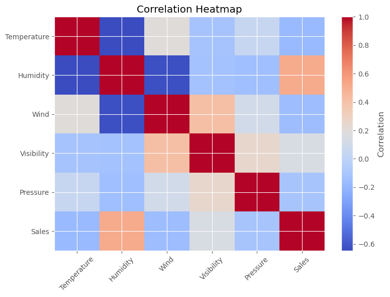
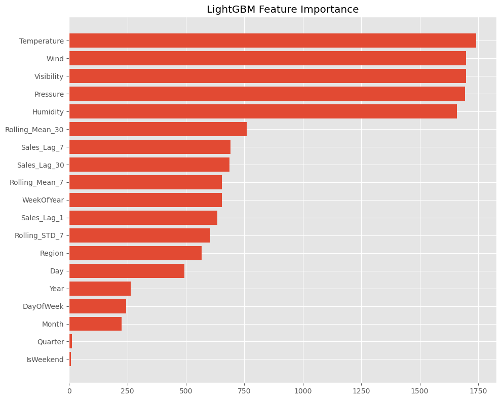
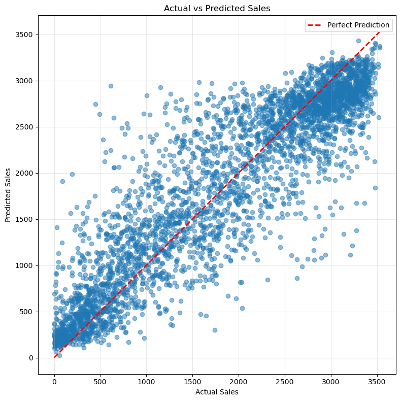
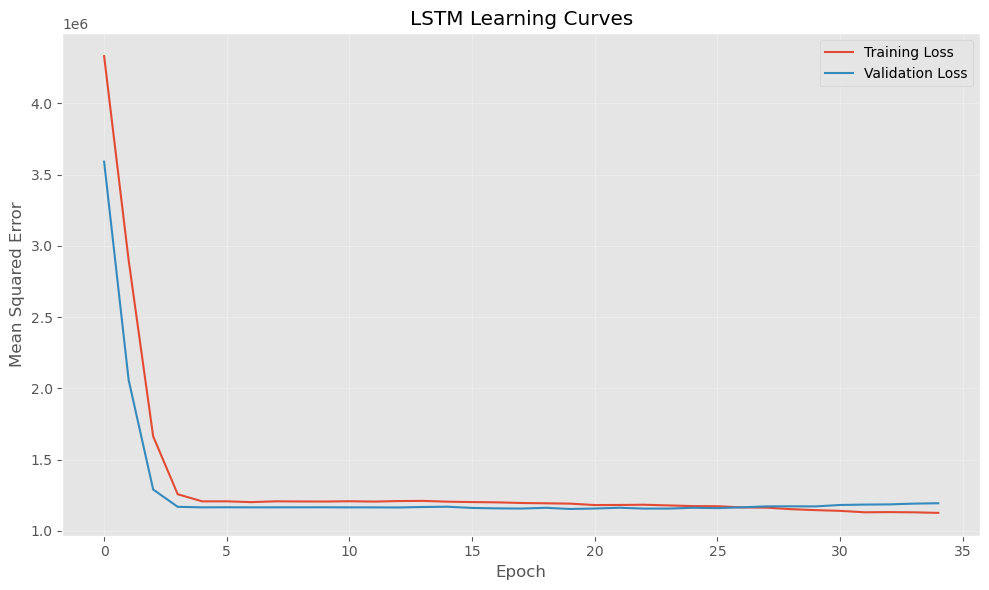

# 🍔 Burger Sales Forecasting using Machine Learning and Deep Learning


---
## 📸 Repository Preview



## 📌 Project Overview

This project develops a sales forecasting system for a fictional burger restaurant chain using weather conditions, regional information, and calendar-based features.

The objective is to predict daily burger sales and compare the performance of traditional machine learning techniques against deep learning models.

Three predictive models were evaluated:

- LightGBM
- LSTM Experiment 1
- LSTM Experiment 2

The project follows an end-to-end data science workflow from raw data exploration through feature engineering, model development, evaluation, and deployment preparation.

---

## 🎯 Business Problem

Accurate sales forecasting enables restaurants to:

- Improve inventory management
- Reduce food waste
- Optimize staffing levels
- Improve supply chain planning
- Increase operational efficiency

This project demonstrates how predictive analytics can support business decision-making using historical sales and environmental data.

---

## 📂 Dataset

The dataset contains daily observations including:

| Feature | Description |
|----------|-------------|
| Date | Observation date |
| Region | Restaurant region |
| Temperature | Daily average temperature |
| Humidity | Daily humidity |
| Wind | Wind speed |
| Visibility | Visibility |
| Pressure | Atmospheric pressure |
| Sales | Daily burger sales (Target Variable) |

After preprocessing the dataset contained:

- **24,422 observations**
- **19 predictive features**
- Multiple engineered calendar and lag features

---

## ⚙️ Project Workflow

```text
Raw Dataset
      │
      ▼
Data Cleaning
      │
      ▼
Exploratory Data Analysis
      │
      ▼
Feature Engineering
      │
      ▼
Data Preprocessing
      │
      ▼
LightGBM
      │
      ├──────────────┐
      ▼              ▼
LSTM Experiment 1   LSTM Experiment 2
      │              │
      └──────┬───────┘
             ▼
      Model Evaluation
             ▼
 AWS SageMaker Deployment Preparation
```

---

## 📁 Repository Structure

```
Burger_Sales_Forecasting/

│── data/
│── notebooks/
│── models/
│── reports/
│── images/
│── README.md
│── requirements.txt
│── LICENSE
```

---

## 📚 Notebooks

| Notebook | Description |
|-----------|-------------|
| 01 | Data Exploration |
| 02 | Data Cleaning |
| 03 | Feature Engineering |
| 04 | Data Preprocessing |
| 05 | LightGBM Model |
| 06 | Explainability |
| 07 | LSTM Experiment 1 |
| 08 | Model Evaluation |
| 09 | AWS SageMaker Deployment |
| 10 | LSTM Experiment 2 |

---
## 📊 Exploratory Data Analysis

### Sales Distribution



### Correlation Heatmap



## 🤖 Models Developed

### LightGBM

Gradient boosting decision tree model trained using engineered weather and calendar features.

### LSTM Experiment 1

Baseline Long Short-Term Memory neural network.

### LSTM Experiment 2

Improved LSTM architecture using:

- Feature scaling
- Target scaling
- Two stacked LSTM layers
- Dropout regularization
- Learning rate scheduling
- Early stopping

---

## 📊 Model Performance

| Model | MAE | RMSE | R² | SMAPE |
|--------|-----:|------:|------:|------:|
| **LightGBM** | **353.58** | **478.57** | **0.8068** | **30.61%** |
| LSTM Experiment 1 | 969.92 | 1088.14 | 0.0017 | 62.15% |
| LSTM Experiment 2 | 954.69 | 1082.29 | 0.0124 | 61.16% |

## 📈 Model Visualizations

### LightGBM Feature Importance



### LightGBM Predictions



### LSTM Training History


---

## 📈 Key Findings

- LightGBM significantly outperformed both LSTM models.
- Calendar and weather features contributed strongly to prediction accuracy.
- Feature engineering substantially improved model performance.
- Deep learning was less effective for this structured tabular dataset.
- Tree-based ensemble methods proved more suitable for this forecasting task.

---

## 🛠 Technologies Used

- Python
- Pandas
- NumPy
- Matplotlib
- Seaborn
- Scikit-Learn
- LightGBM
- TensorFlow / Keras
- Joblib
- Jupyter Notebook

---

## 🚀 Installation

Clone the repository

```bash
git clone https://github.com/Bennyaks/Burger_Sales_Forecasting.git
```

Move into the project

```bash
cd Burger_Sales_Forecasting
```

Install dependencies

```bash
pip install -r requirements.txt
```

---

## ▶️ Running the Project

Run the notebooks in numerical order:

```
01 → 02 → 03 → 04 → 05 → 06 → 07 → 08 → 09 → 10
```

---

## 🔮 Future Improvements

- Hyperparameter optimization using Optuna
- XGBoost comparison
- CatBoost comparison
- Streamlit dashboard
- Docker deployment
- Real-time inference API
- AWS SageMaker deployment

---

## 👤 Author

**Benard Mandera**

GitHub:

https://github.com/Bennyaks

---

## ⭐ Acknowledgements

This project was developed as part of a professional machine learning portfolio demonstrating end-to-end data science skills including data preprocessing, feature engineering, machine learning, deep learning, and model evaluation.